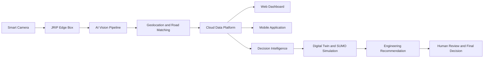
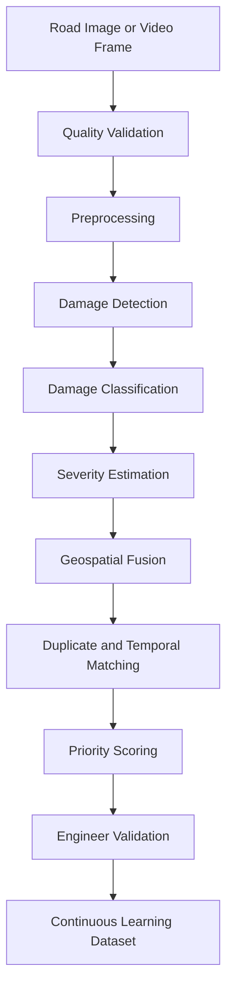
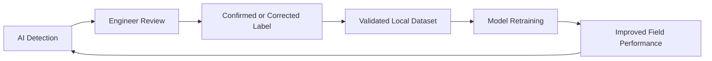
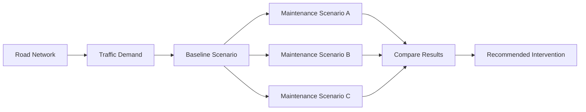
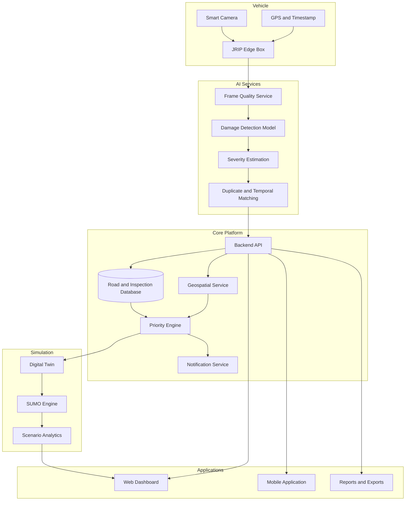

<div align="center">

# JRIP — Jordan Road Intelligence Platform

### AI-Powered Road Inspection, Digital Twin Simulation, and Decision Intelligence

**Smarter Roads. Safer Future. Better Decisions.**

[](#project-status)
[](#the-ai-core)
[](#digital-twin-and-traffic-simulation)
[](#platform-modules)

</div>

---

## Overview

**JRIP** is an intelligent road-management platform that transforms ordinary vehicles into mobile road-inspection units.

A camera mounted on a municipal, engineering, or maintenance vehicle continuously captures road conditions while the vehicle performs its normal route. JRIP processes the collected data using computer vision, associates every detected issue with its location and time, stores the results in a centralized platform, and converts raw observations into engineering priorities and decision-ready insights.

JRIP does not stop at detecting damage. It combines:

- **Artificial intelligence** for road-damage detection and classification.
- **Geospatial intelligence** for mapping every issue to the correct road segment.
- **Decision intelligence** for prioritizing maintenance according to severity, road importance, traffic impact, and operational constraints.
- **Digital twin and traffic simulation** for testing interventions before they are implemented in the real world.
- **Human-in-the-loop validation** so engineers remain responsible for final technical approval.

The platform is designed to help municipalities, road authorities, maintenance companies, contractors, and engineering firms move from **reactive road repair** to **proactive and predictive infrastructure management**.

---

## The Problem

Road-maintenance operations often depend on periodic manual inspections, citizen reports, disconnected spreadsheets, and delayed field responses.

This creates four major challenges:

1. **Late damage detection** — defects are often discovered only after they become severe.
2. **Fragmented information** — images, locations, reports, and maintenance records are stored in different systems.
3. **Limited network visibility** — decision-makers do not always have a live, unified view of road conditions.
4. **Higher maintenance costs** — delayed intervention increases repair cost, road deterioration, congestion, and safety risk.

Traditional systems answer the question:

> Where is the damage after someone reports it?

JRIP is designed to answer a more powerful set of questions:

> What damage exists, where is it, how severe is it, how is it evolving, what should be repaired first, and what will happen if we choose a specific intervention?

---

## Our Solution

JRIP creates an end-to-end intelligent workflow from the road to the decision-maker.



### End-to-end workflow

1. A vehicle captures road images or video during normal movement.
2. The JRIP edge unit organizes and securely stores the data.
3. The AI pipeline detects, localizes, and classifies road defects.
4. Each detection is linked to GPS coordinates, time, road segment, and inspection history.
5. Engineers validate results through the web or mobile interface.
6. The system calculates maintenance priority and generates actionable insights.
7. Proposed interventions can be tested inside a digital traffic twin before field implementation.
8. Decision-makers approve, reject, or request modifications to recommendations.
9. Maintenance execution is tracked until the issue is resolved.

---

# The AI Core

Artificial intelligence is not an optional feature in JRIP. It is the central engine that transforms road imagery into structured infrastructure intelligence.

The AI architecture is designed as a multi-stage pipeline rather than a single model.



## 1. Computer Vision for Road-Damage Detection

The vision module analyzes images captured from moving vehicles and identifies abnormal road-surface patterns.

The detector is designed to recognize classes such as:

- Potholes.
- Longitudinal cracks.
- Transverse cracks.
- Alligator or fatigue cracking.
- Surface wear.
- Edge breaks.
- Depressions and deformation.
- Drainage-related damage.
- Shoulder deterioration.
- Other configurable road defects.

The model does more than classify the entire image. It localizes each defect using a bounding box or segmentation mask, allowing JRIP to distinguish between multiple defects in the same frame.

The implementation is **model-agnostic** and can support modern deep-learning detectors or segmentation models such as YOLO-family architectures, Faster R-CNN, Detectron2, RT-DETR, or segmentation-based networks, depending on the accuracy, latency, and hardware requirements of the deployment.

> The exact production model should be selected based on validated field performance, not only laboratory accuracy.

## 2. Image Quality and Data Validation

Real-world road imagery is noisy. Images may contain:

- Motion blur.
- Low light.
- Rain or reflections.
- Vehicle shadows.
- Occlusion.
- Lens vibration.
- Different pavement colors.
- Camera-angle variation.

Before inference, JRIP can apply a quality-validation stage to reject or flag frames that are too blurred, too dark, overexposed, or visually unusable.

This reduces false detections and prevents low-quality data from affecting maintenance decisions.

## 3. Preprocessing and Data Augmentation

To improve robustness, the AI pipeline may include:

- Frame extraction from video.
- Resizing and normalization.
- Contrast and illumination correction.
- Region-of-interest filtering to focus on the road surface.
- Blur and exposure checks.
- Data augmentation during training, including brightness changes, shadows, rotation, perspective variation, noise, and weather simulation.

The goal is to build a model that works on real Jordanian roads, not only on clean benchmark images.

## 4. Damage Classification

After localization, each detected region is assigned a damage class.

The output can include:

```json
{
  "damage_type": "pothole",
  "confidence": 0.93,
  "bounding_box": [421, 238, 612, 417],
  "frame_id": "frame_001284",
  "timestamp": "2026-07-19T10:42:17Z"
}
```

Confidence scores allow the system to separate high-confidence detections from cases that require additional engineering review.

## 5. Severity Estimation

Detection alone is not enough. JRIP is designed to estimate the engineering importance of each issue.

Severity can be calculated using a combination of:

- Visible area of the defect.
- Estimated width, length, or depth when measurable.
- Damage class.
- Confidence score.
- Road type and functional classification.
- Lane position.
- Traffic volume.
- Nearby critical facilities.
- Historical growth of the same defect.
- Engineer-defined rules.

Example severity levels:

- **Low** — monitor and include in preventive maintenance.
- **Medium** — schedule repair.
- **High** — prioritize in the near-term maintenance plan.
- **Critical** — immediate field verification or emergency intervention.

The system should always display why a defect received its severity level.

## 6. Geospatial AI and Road-Segment Matching

Every AI result becomes useful only when it is linked to the correct physical location.

JRIP fuses:

- GPS coordinates.
- Camera timestamps.
- Vehicle route history.
- Road-network geometry.
- Direction of travel.
- Lane or segment metadata when available.

This allows the platform to place each detected issue on the smart map and associate it with a specific road segment.

Geospatial matching also helps avoid duplicate records when the same defect is captured in multiple frames or on repeated inspection trips.

## 7. Duplicate Detection and Temporal Tracking

A single pothole may appear in many consecutive video frames. Without temporal intelligence, the platform could incorrectly create multiple records for the same issue.

JRIP can reduce duplicates using:

- Spatial distance thresholds.
- Time proximity.
- Visual similarity.
- Road-segment matching.
- Tracking across consecutive frames.

Over time, the same mechanism can support deterioration tracking:

- New issue.
- Existing issue.
- Worsening issue.
- Repaired issue.
- Reappeared issue.

This creates a digital history of every road defect.

## 8. Priority Scoring and Decision Intelligence

The AI pipeline does not end with computer vision.

JRIP converts validated defects into a maintenance-priority score.

A configurable priority function may include:

```text
Priority Score =
    Severity Weight
  + Traffic Impact
  + Road Importance
  + Safety Risk
  + Damage Growth
  + Time Since Detection
  + Proximity to Critical Facilities
  - Current Maintenance Coverage
```

The score is not intended to replace engineering judgment. It is designed to make prioritization:

- Faster.
- More consistent.
- More transparent.
- Easier to audit.

Decision-makers can see not only the recommendation but also the factors that produced it.

## 9. Explainable AI

Infrastructure decisions require trust.

JRIP is designed to provide explainable outputs such as:

- The detected damage class.
- The model confidence.
- The highlighted damage region.
- The severity level.
- The factors that influenced priority.
- The evidence image.
- The location and time.
- The inspection and maintenance history.

This creates a traceable path from **raw image** to **engineering decision**.

## 10. Human-in-the-Loop Validation

JRIP does not remove engineers from the process.

Engineers can:

- Confirm or reject detections.
- Correct the damage class.
- Adjust severity.
- Add measurements and notes.
- Request a field inspection.
- Link a defect to a maintenance project.
- Approve or reject AI-generated recommendations.

This workflow protects decision quality and generates valuable labeled data for future model improvement.

## 11. Continuous Learning

Every validated correction can become part of a future training dataset.



This feedback loop allows the system to become more accurate on:

- Local pavement types.
- Jordanian weather and lighting.
- Different cities and road environments.
- Camera positions.
- Newly introduced damage classes.

## 12. Edge AI and Cloud AI

JRIP can support two inference modes.

### Edge inference

The model runs inside the vehicle or on the JRIP Box.

Advantages:

- Lower latency.
- Reduced bandwidth use.
- Operation in weak-connectivity areas.
- Immediate alerts for critical defects.

### Cloud inference

Data is uploaded and processed on a server.

Advantages:

- More powerful models.
- Easier centralized updates.
- Better large-scale analytics.
- Unified model monitoring.

A hybrid architecture can run lightweight detection on the edge and detailed analysis in the cloud.

## 13. AI Evaluation

JRIP should evaluate the AI model using documented engineering and machine-learning metrics.

Recommended metrics include:

- Precision.
- Recall.
- F1-score.
- mAP@0.5.
- mAP@0.5:0.95.
- Per-class accuracy.
- False-positive rate.
- False-negative rate.
- Inference time.
- Frames per second.
- Geolocation error.
- Duplicate-detection rate.

### Validation table

Replace the placeholders below only with measured results.

| Metric | Result |
|---|---:|
| Dataset size | `TBD` |
| Damage classes | `TBD` |
| Precision | `TBD` |
| Recall | `TBD` |
| mAP@0.5 | `TBD` |
| Average inference time | `TBD` |
| Tested road distance | `TBD` |
| Field conditions | `TBD` |

> Do not publish estimated accuracy as a final result. Only validated test results should be reported.

---

# Digital Twin and Traffic Simulation

JRIP combines road-condition intelligence with a digital representation of the road network.

Using **SUMO — Simulation of Urban MObility**, engineers can model road geometry, lanes, intersections, vehicle flows, signals, closures, and alternative routes.

## Simulation questions JRIP can answer

- What happens if one lane is closed for maintenance?
- How much delay will the intervention create?
- Which alternative route performs best?
- Should work be executed during the day or at night?
- Is a full closure better than phased maintenance?
- How many vehicles will be affected?
- What is the expected congestion level?
- Which maintenance scenario provides the best balance between cost, safety, and traffic performance?

## Simulation workflow



## Example simulation outputs

- Average vehicle speed.
- Average delay.
- Travel time.
- Queue length.
- Number of stops.
- Throughput.
- Congestion level.
- Emission estimates.
- Number of affected vehicles.
- Network performance index.

JRIP uses simulation to test decisions before real-world implementation.

**Computer vision identifies what is wrong. Digital twins test what should happen next.**

---

# Platform Modules

## 1. Authentication and Role-Based Access

- Secure login.
- Arabic and English interface.
- Role-based permissions.
- Account activation and deactivation.
- Activity logging.

### Main roles

- System administrator.
- Engineer.
- Decision-maker.
- Field inspector.
- Maintenance team.

## 2. Executive Dashboard

- Total roads.
- Road-condition distribution.
- New and critical damages.
- Active maintenance projects.
- Pending recommendations.
- Recent activity.
- Smart alerts.
- High-level performance indicators.

## 3. Smart Map

- Interactive road network.
- Damage markers.
- Road-condition colors.
- Maintenance-project layers.
- Traffic and simulation layers.
- Search and advanced filters.
- Road details and history.

## 4. Roads Management

- Add and edit roads.
- Road classification.
- Length, width, lanes, and direction.
- Inspection history.
- Maintenance history.
- Damage history.
- Map-based road selection.

## 5. Damage Management

- AI-detected and manually reported defects.
- Evidence images and videos.
- Damage type and severity.
- Location and discovery time.
- Review workflow.
- Repair status.
- Duplicate handling.
- Before-and-after comparison.

## 6. Maintenance Management

- Maintenance requests.
- Project creation.
- Linked defects.
- Priority and status.
- Budget and contractor information.
- Start and end dates.
- Progress tracking.
- Delays and risk alerts.
- Before, during, and after documentation.

## 7. Simulation Projects

- Create simulation studies.
- Select roads and road segments.
- Define the baseline.
- Create intervention scenarios.
- Configure traffic demand.
- Compare scenario performance.

## 8. Simulation Workspace

- Network editor.
- Scenario controls.
- SUMO execution.
- Live performance indicators.
- Scenario comparison.
- Export simulation results.

## 9. Recommendations

- AI-assisted engineering recommendations.
- Supporting evidence.
- Scenario comparison.
- Expected impact.
- Risk and cost summary.
- Decision-maker notes.
- Approve, reject, or request modification.

## 10. Reports

- Road-condition reports.
- Damage reports.
- Maintenance reports.
- Simulation reports.
- Recommendation reports.
- PDF and spreadsheet export.
- Scheduled reporting.

## 11. User Management

- Add and edit users.
- Assign roles.
- Activate or deactivate accounts.
- Reset credentials.
- Review system activity.

---

# System Architecture



---

# Suggested Technology Stack

The exact stack can be changed according to the final implementation.

## Frontend

- HTML5, CSS3, JavaScript.
- React, Vue, or server-rendered templates.
- Responsive web design.
- Leaflet, Mapbox, or OpenLayers for maps.

## Backend

- Node.js with Express, Python with FastAPI, or another REST-compatible framework.
- REST API or GraphQL.
- WebSocket support for live simulation and status updates.

## AI and Data Processing

- Python.
- PyTorch or TensorFlow.
- OpenCV.
- Object detection or segmentation models.
- NumPy and Pandas.
- Model export through ONNX when edge deployment is required.

## Database and Geospatial Layer

- PostgreSQL.
- PostGIS.
- Redis for caching and task state.
- Object storage for images and videos.

## Simulation

- SUMO.
- TraCI.
- OpenStreetMap-derived networks when legally and technically appropriate.

## Deployment

- Docker.
- Nginx.
- CI/CD pipeline.
- Cloud or on-premise deployment.
- Edge deployment for the JRIP Box.

---

# Repository Structure

A recommended repository structure is shown below.

```text
JRIP/
├── apps/
│   ├── web-dashboard/
│   ├── mobile-app/
│   └── admin-portal/
├── services/
│   ├── api/
│   ├── ai-vision/
│   ├── geospatial/
│   ├── priority-engine/
│   ├── notifications/
│   └── simulation/
├── edge/
│   ├── camera-capture/
│   ├── gps-sync/
│   ├── local-storage/
│   └── edge-inference/
├── models/
│   ├── checkpoints/
│   ├── configs/
│   └── exports/
├── datasets/
│   ├── raw/
│   ├── annotations/
│   ├── processed/
│   └── splits/
├── simulations/
│   ├── networks/
│   ├── routes/
│   ├── scenarios/
│   └── outputs/
├── docs/
│   ├── architecture/
│   ├── api/
│   ├── ai/
│   └── business/
├── tests/
├── docker-compose.yml
├── .env.example
├── LICENSE
└── README.md
```

---

# Quick Start

> Update this section to match the actual repository commands.

## 1. Clone the repository

```bash
git clone https://github.com/<USERNAME>/<REPOSITORY>.git
cd <REPOSITORY>
```

## 2. Create environment variables

```bash
cp .env.example .env
```

## 3. Start the platform

```bash
docker compose up --build
```

## 4. Run the AI service independently

```bash
cd services/ai-vision
python -m venv .venv
```

### Windows

```bash
.venv\Scripts\activate
```

### Linux or macOS

```bash
source .venv/bin/activate
```

```bash
pip install -r requirements.txt
python app.py
```

## 5. Run a SUMO simulation

```bash
sumo-gui -c simulations/scenarios/example/osm.sumocfg
```

Or through Python and TraCI:

```bash
python services/simulation/run_simulation.py \
  --config simulations/scenarios/example/osm.sumocfg
```

---

# Example AI API

## Request

```http
POST /api/v1/ai/detect
Content-Type: multipart/form-data
```

```text
image: road_frame.jpg
latitude: 31.9539
longitude: 35.9106
timestamp: 2026-07-19T10:42:17Z
```

## Response

```json
{
  "inspection_id": "INSP-2026-000148",
  "detections": [
    {
      "damage_id": "DMG-2026-000721",
      "damage_type": "pothole",
      "confidence": 0.93,
      "severity": "high",
      "priority_score": 87,
      "location": {
        "latitude": 31.9539,
        "longitude": 35.9106,
        "road_segment_id": "RD-AMM-1042"
      },
      "requires_review": true
    }
  ]
}
```

---

# Security and Responsible AI

JRIP is intended for infrastructure management and must be developed with security and responsible-AI controls.

Recommended safeguards include:

- Encryption in transit and at rest.
- Role-based access control.
- Audit logs for critical actions.
- Secure device authentication.
- Image-retention policies.
- Face and license-plate blurring when required.
- Data minimization.
- Model-version tracking.
- Confidence thresholds.
- Human review for high-impact decisions.
- Monitoring for model drift.
- Separate validation across cities, weather, lighting, and pavement types.

The AI system should assist engineering decisions, not make irreversible public-infrastructure decisions without authorized human approval.

---

# Target Users

- Municipalities.
- Ministry of Public Works and road authorities.
- Road-maintenance companies.
- Contractors.
- Engineering and consulting firms.
- Smart-city programs.
- Infrastructure asset-management teams.

---

# Business Model

JRIP can be delivered as a business-to-government or business-to-business platform.

Potential revenue streams include:

- Annual platform subscription.
- Per-vehicle JRIP hardware kit.
- Installation and calibration fees.
- AI analytics subscription.
- Digital-twin simulation services.
- Maintenance and technical support contracts.
- Custom reports and integrations.
- Pilot-project implementation.
- Enterprise or nationwide licensing.

Possible pricing can depend on:

- Number of vehicles.
- Road-network length.
- Number of users.
- Data volume.
- AI processing volume.
- Number of simulation projects.
- Required integrations and support level.

---

# Expected Impact

JRIP aims to create measurable value through:

- Earlier damage detection.
- Faster field response.
- Better maintenance prioritization.
- Lower avoidable repair cost.
- Longer road lifespan.
- Improved road safety.
- More transparent resource allocation.
- Better coordination between authorities, engineers, and contractors.
- Reduced disruption through pre-implementation simulation.

Validated impact figures should be added after pilot testing.

---

# Project Roadmap

## Phase 1 — Prototype

- Complete camera-to-platform workflow.
- Build the first labeled road-damage dataset.
- Integrate AI inference.
- Complete the initial web dashboard.
- Connect the first SUMO scenario.

## Phase 2 — Pilot Testing

- Test on selected roads.
- Collect local field data.
- Measure AI accuracy and geolocation quality.
- Test day, night, weather, and speed variation.
- Gather engineer feedback.

## Phase 3 — Institutional Integration

- Integrate with municipality workflows.
- Add role-based approvals.
- Connect maintenance contractors.
- Automate reports and notifications.

## Phase 4 — Predictive Intelligence

- Add deterioration forecasting.
- Build road-health trends.
- Predict maintenance demand.
- Optimize budget allocation.

## Phase 5 — Nationwide Deployment

- Expand across Jordan.
- Create a unified national road-intelligence layer.
- Support government-level planning and policy decisions.

---

# Project Status

JRIP is currently presented as a prototype and development-stage platform.

Before describing the project as production-ready, the following should be validated:

- Real field dataset size.
- AI accuracy.
- Edge-device performance.
- GPS matching accuracy.
- Security testing.
- Pilot results.
- Operational integration with a real authority.

---

# Team

## Yousef Yasin

- AI and software development.
- System architecture.
- Computer vision.
- Traffic simulation and platform integration.

## Ruaa Hussin

- Product design and user experience.
- Research and documentation.
- Project coordination and presentation.

> Update roles to match the actual responsibilities of each team member.

---

# Why JRIP

JRIP is not only a damage-detection model.

It is an integrated infrastructure-intelligence system that connects:

- What the camera sees.
- What the AI understands.
- Where the issue exists.
- How severe it is.
- What should be prioritized.
- What may happen under each intervention.
- What the engineer finally approves.

> **A camera sees. AI understands. A digital twin tests. An engineer decides.**

---

# Contributing

Contributions are welcome in areas such as:

- Road-damage datasets.
- Computer vision.
- Model optimization.
- Edge deployment.
- Geospatial systems.
- SUMO simulation.
- Web and mobile development.
- Infrastructure engineering.
- Responsible AI.

Please open an issue before submitting major changes.

---

# License

Add the appropriate license before public release.

Recommended options:

- MIT for open-source software.
- Apache License 2.0 for broader patent protection.
- Proprietary licensing if the platform is intended for commercial deployment.

---

# Contact

For collaboration, pilots, research, or institutional partnerships:

- **Project:** JRIP — Jordan Road Intelligence Platform
- **Team:** Yousef Yasin and Ruaa Hussin
- **Location:** Jordan
- **Email:** `<ADD_EMAIL>`
- **Repository:** `<ADD_REPOSITORY_URL>`

---

<div align="center">

## JRIP

### From Reactive Maintenance to Predictive Road Intelligence

**Smart Roads. Safer Future.**

</div>
